# Localization matrix (Contentful App)

The app aims to extend [Contentful CMS](https://www.contentful.com/) to represent localisation information for the content dependencies tree. It is developed according to the [App Framework](https://www.contentful.com/developers/docs/extensibility/app-framework/) documentation.

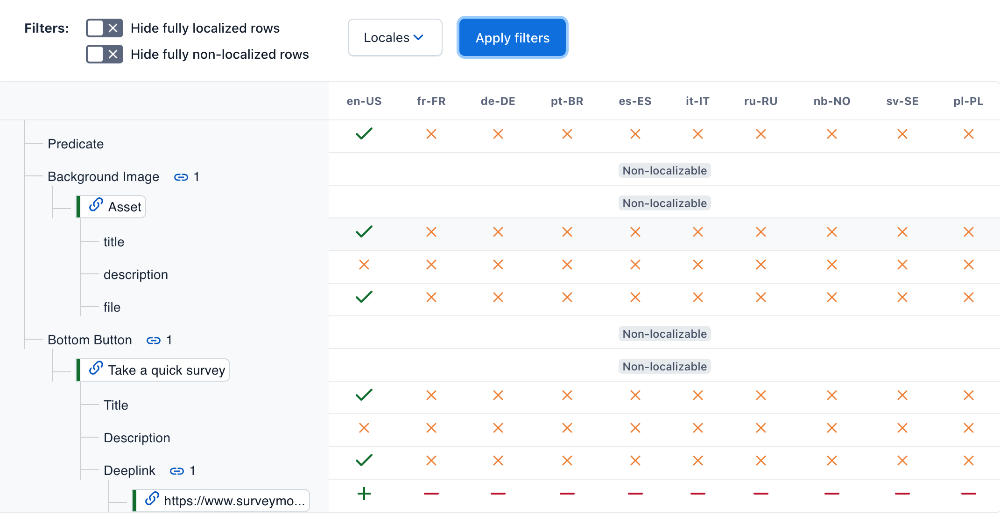

## Table of contents

- [Motivation](#motivation)
- [Features](#features)
- [Configuration](#configuration)
- [Usage](#usage)
- [Contributing guidelines](#contributing-guidelines)
- [License](#license)

## Motivation

The primary motivator for the app is how Contentful implements localization out of the box. When content hierarchy is complicated, the localization process becomes complex and error prone. Contentful doesn't allow you to simply visualize your content hierarchy and highlight the gaps in localization. So, the app aims to:

- Help review content localization status and find non-localized pieces of content down the hierarchy
- Provide a more convenient way of detecting and troubleshooting localization issues

## Features

Here's the list of features that the matrix provides to a user:

- Displaying the `localization status` of all the simple (non-references) fields of the selected entry and recursively of its dependencies. By hovering over the cell, you will see a hint:
  - 

    
Example of simple field indication. A green tick means the field has a value for a particular locale. A hint displays this value. When hovering over the "file" property, you will see the image for the selected locale.

    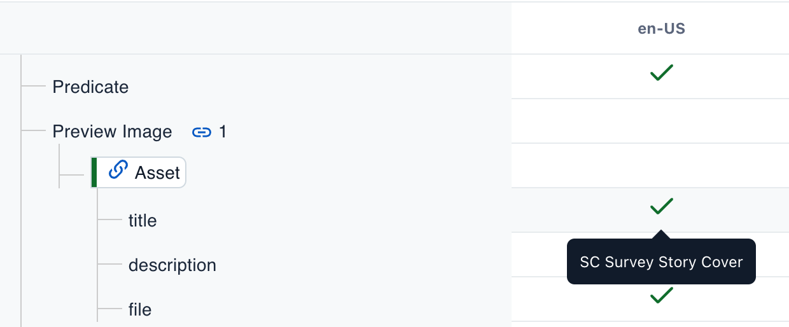
    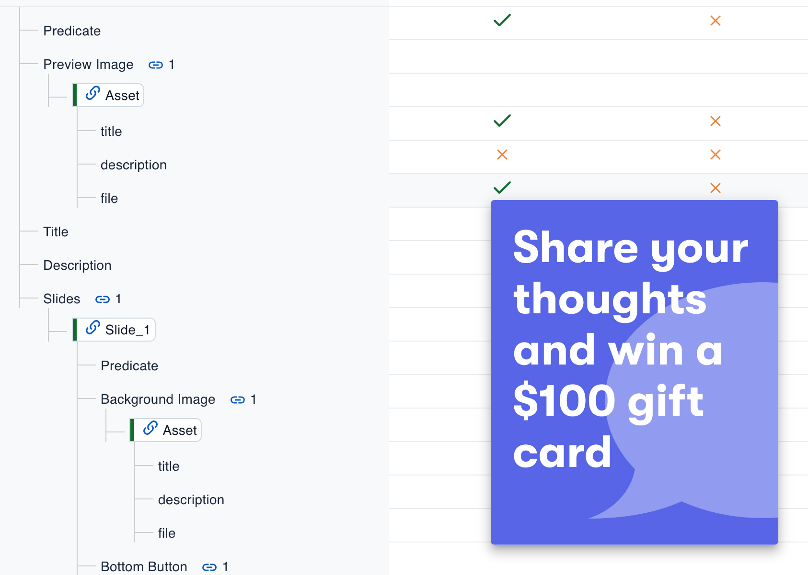
    

  - 

    
Example of indication for a reference. The icon is slightly different from the previous one because of its meaning: It indicates for which locales this particular entry is used. It could be useful if you attach the same entry to its parent in multiple locales.

    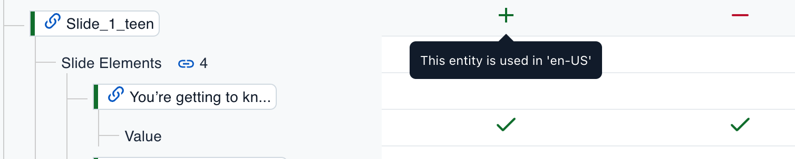
    

- `Displaying entity status` using built-in [InlineEntryCard](https://f36.contentful.com/components/inline-entry-card) component.
  - 

    
Example

    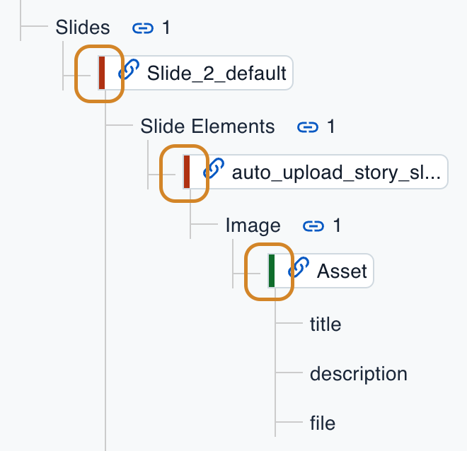
    

- `Displaying a content type` of a reference by hovering over the link icon.
  - 

    
Example

    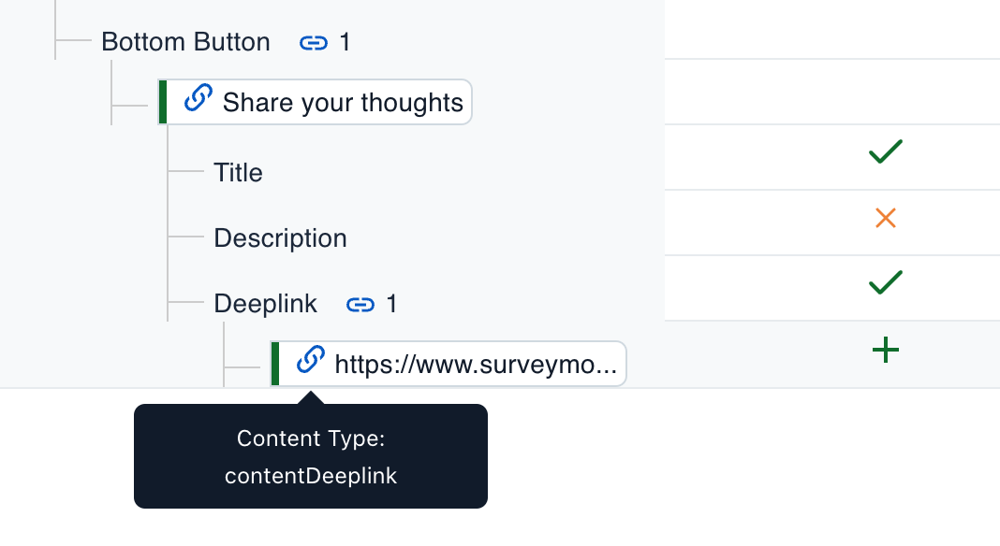
    

- `Displaying references count` of reference type field. Also, a special icon, `link` is displayed, indicating that the field is a reference type.
  - 

    
Example

    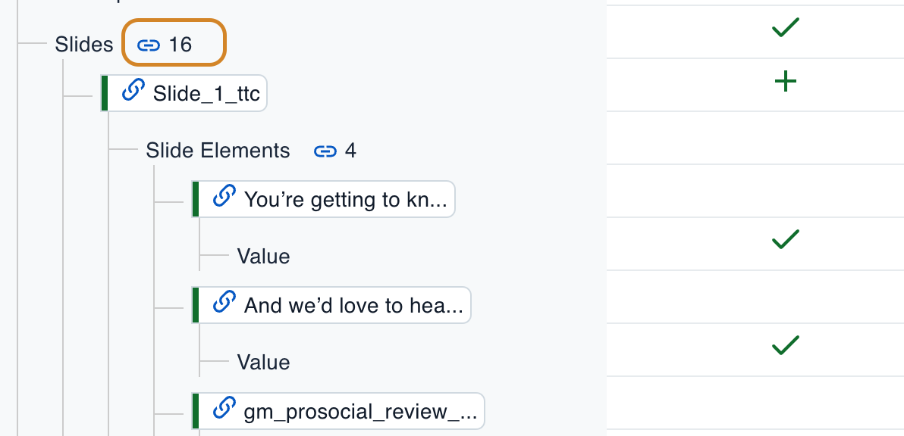
    

- `Handling recursive structures`: If an entry is referenced by itself in its dependencies chain, a special icon will be displayed. When found, the matrix doesn't load its children again, breaking the infinite loading cycle.
  - 

    
Example

    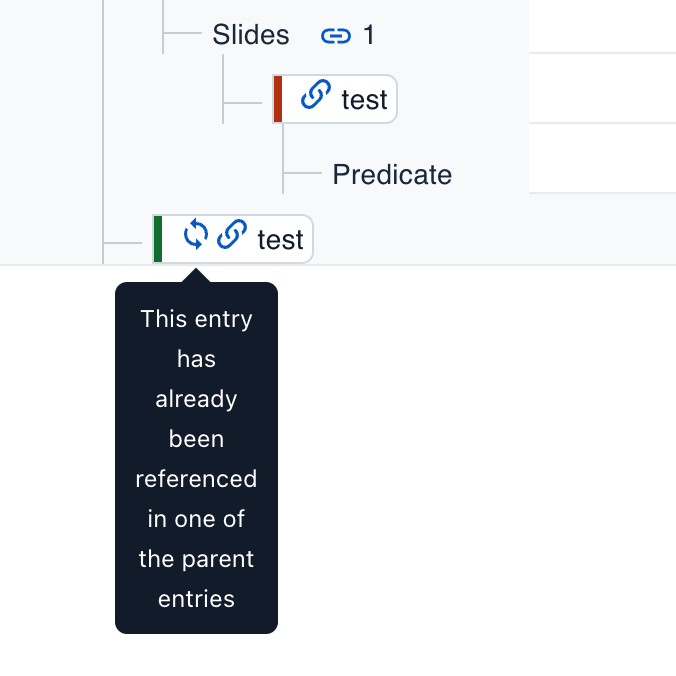
    

- Selecting only `specific locales` to display from the list of all the locales supported in a space (expand to see an example).
  - 

    
Example

    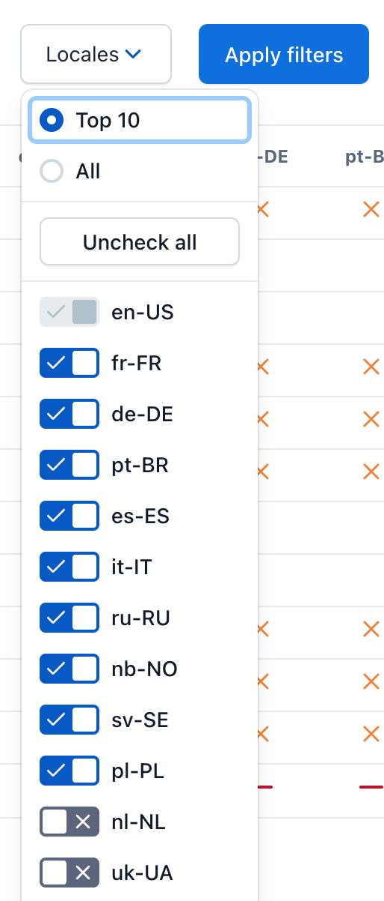
    

- Configurable `quick locale sets`: You can set up your own quick sets in [configuration](#configuration)

  - 

    
Example

    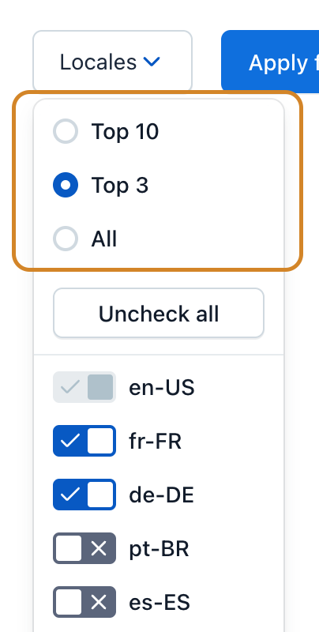
    

- Optional `Uncheck all locales` button: When pressed, it deselects all the selected locales in the list. You can hide the button in the [configuration](#configuration).
- Optional `Filter fully localized rows` filter: When `On`, it filters out the rows with the green ticks for all selected locales. Use it if you’re looking for non-localized or partially localized content items. You can hide the button in the [configuration](#configuration).
- Optional `Filter fully non-localized rows` filter: Works the opposite way as the previous one: If `On`, it filters out the rows with the red crosses for all selected locales. Use it if you’re looking for partially localized data and tolerate the items that are fully non-localized. You can hide the button in the [configuration](#configuration).
- Optional `Break on content type` option: Configure this if you don't want to see entries of a particular content type or their children in the hierarchy. It may be helpful if your content structure has a kind of "technical" content type that may lead to circular dependencies. For example, content deeplink represents the link between different content items in your application but you want to avoid seeing it and its children in the matrix.
- The app optionally sends `usage analytics`: HTTP:GET to the configured endpoint, sending usage data in the query parameters. The implementation is inspired by [this](https://workspace.google.com/marketplace/app/webhooks_for_sheets/860288437469) extension.
- Target host example:
  `https://analytics-host.com/analytics?content_type=story&user_id=asdfqwerqeasdf`

## Configuration

You configure the app's features based on two parameter stores [provided](https://www.contentful.com/developers/docs/extensibility/app-framework/app-parameters/) from Contentful’s SDK: installation and instance parameters:

### Installation parameters

| Parameter        |  Type  | Mandatory | Definition                                                                 |
| ---------------- | :----: | :-------: | -------------------------------------------------------------------------- |
| `analytics_host` | string |    no     | the host for the app's usage analytics, described in the Features section. |

### Instance parameters

| Parameter                    |  Type  | Mandatory |    Default value    | Definition                                                                                                                                                                                                                                       | Example                    |
| ---------------------------- | :----: | :-------: | :-----------------: | ------------------------------------------------------------------------------------------------------------------------------------------------------------------------------------------------------------------------------------------------ | -------------------------- |
| `filter_fully_localized`     |  bool  |    no     |        false        | When set, the `Filter fully localized rows` switch will be displayed in the filters section.                                                                                                                                                     |
| `filter_fully_non_localized` |  bool  |    no     |        false        | When set, the `Filter fully non-localized rows` switch will be displayed in the filters section.                                                                                                                                                 |
| `locales_default`            | string |    yes    |                     | Set the default locale, which is unable to uncheck in the locales filter.                                                                                                                                                                        | en-US                      |
| `locales_all_order`          | string |    no     | order in Contentful | When set, define the order of locales in the locales filter.                                                                                                                                                                                     | en-US, fr-FR, de-DE        |
| `locales_clear_all`          |  bool  |    no     |        false        | When set to true, the `Uncheck all` button will be displayed in the locales filter.                                                                                                                                                              |
| `break_on_content_type`      | string |    no     |                     | When set, configure the `Break on content type` feature in the form of a comma-separated list of content type IDs.                                                                                                                               | story, article             |
| `locales_mode_<mode name>`   | string |    no     |                     | Dynamic parameter. You may configure as many `quick locale buttons` as you need by adding yet another parameter in the following format: `<Mode title>:<comma-separated list of locales>`. `<Mode title>` will be used as the title of a button. | Top 3: en-US, fr-FR, de-DE |

ℹ️ You will find the usage of the parameters mentioned above in the [Config.ts](./src/Config.ts).

Configuration example on the app edit screen in Contentful:

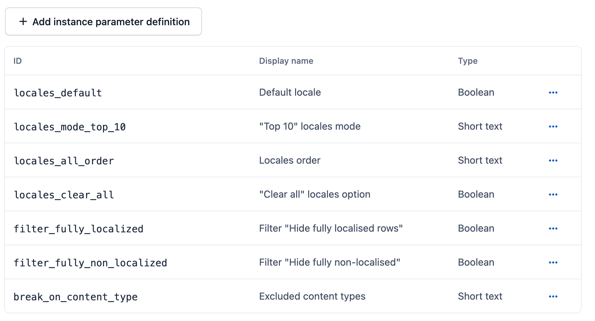

## Usage

You install the app as a Contentful app as usual, according to the [guide](https://www.contentful.com/developers/docs/extensibility/app-framework/deploy-app/).

After installing and configuring the app, you can select it as an entry editor for a particular content type. After that, you will see the corresponding tab on an entry of that content type:

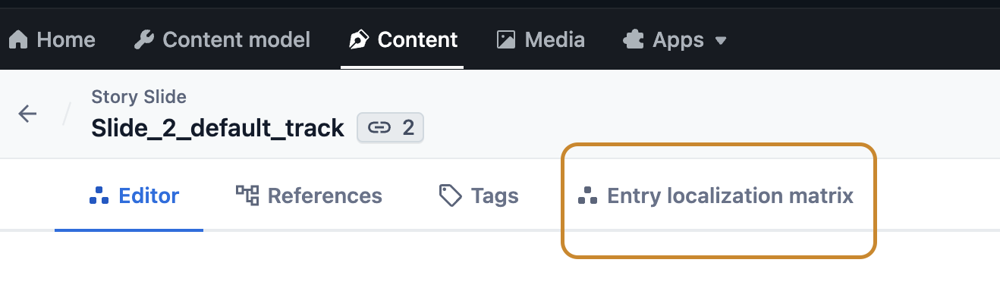

When opening the default matrix page, you will be able to select filters (see [features](#features) section) and load the data to the matrix by pressing the `Apply filters` button.

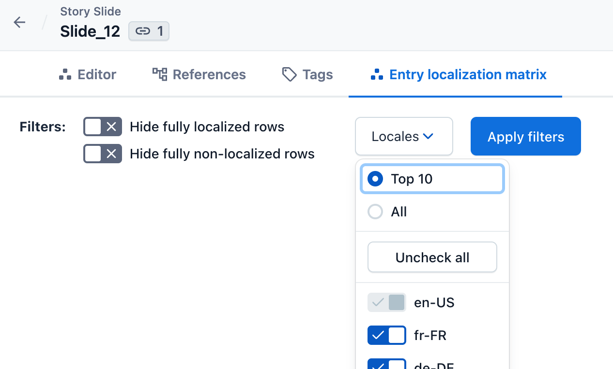

## Contributing guidelines

For detailed information on how to contribute to this project, including bug reporting, feature requests, and pull requests, please refer to our [Contributing guidelines](./CONTRIBUTING.md).

## License

